# Task Master

Teams may use this Android app to handle tasks. Adding, assigning, tracking, and deleting tasks are all part of this process.

***

Screen Shots Log / 09/08/2021

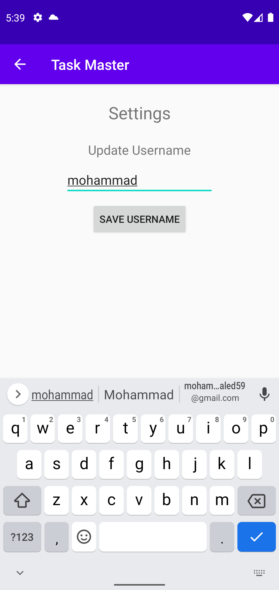

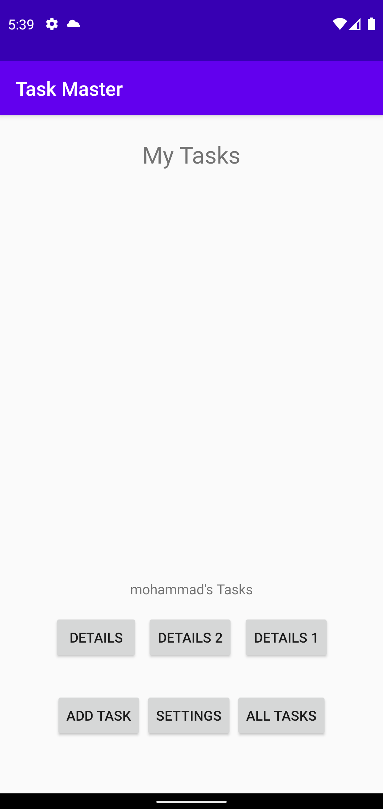

***

Screen Shots Log / 11/08/2021

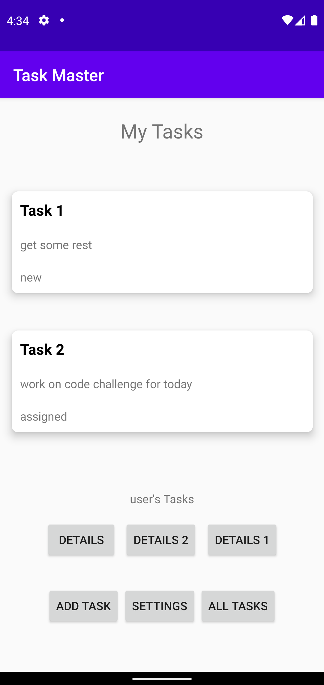

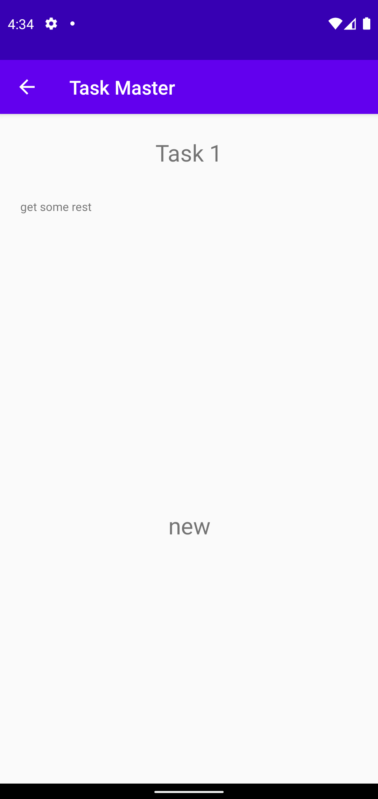

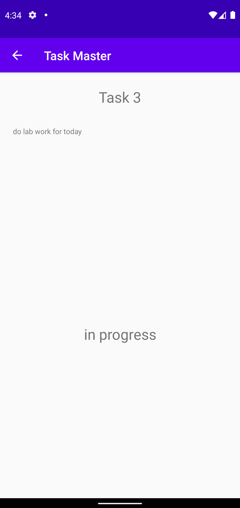

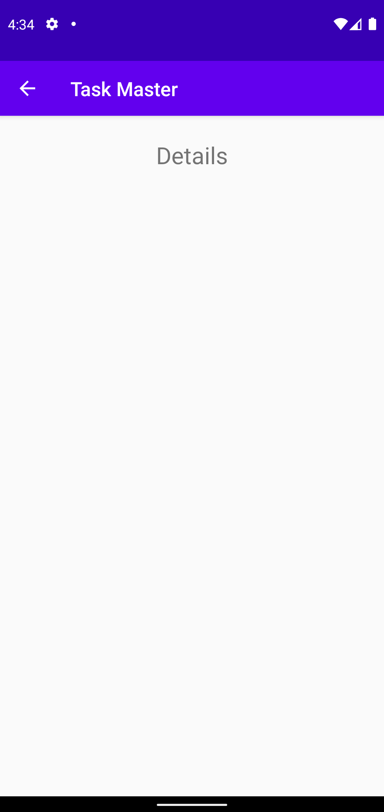

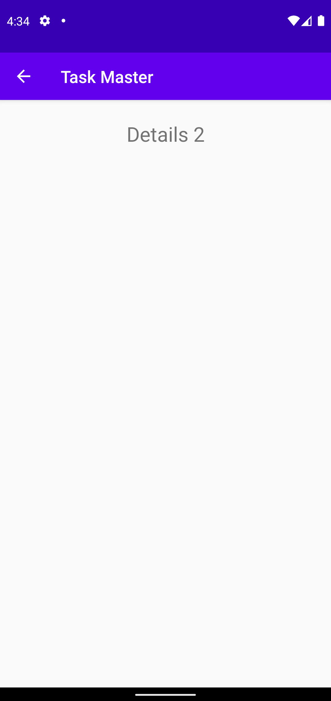

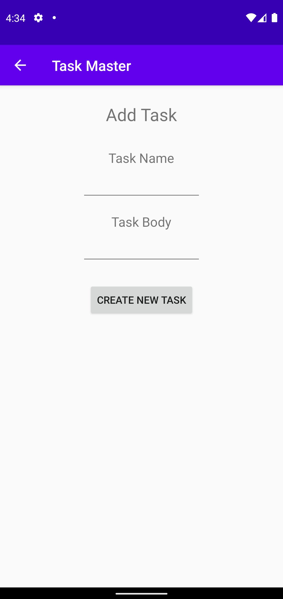

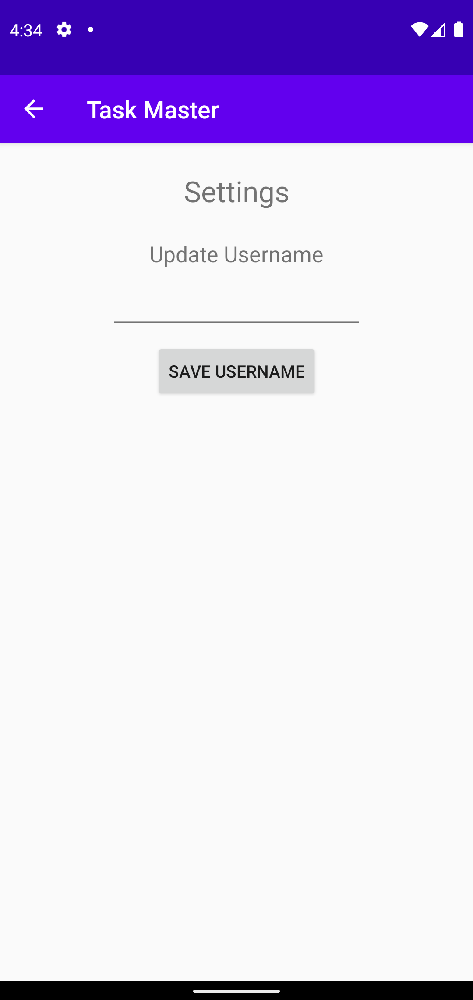

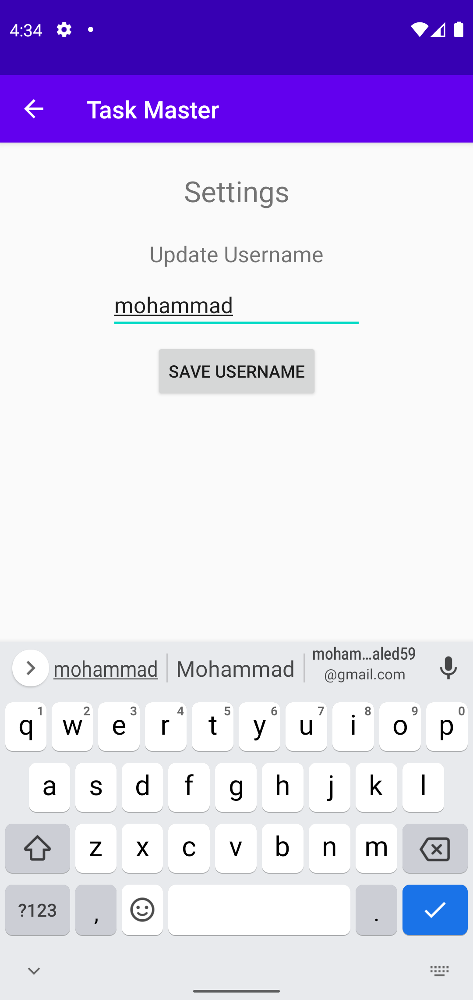

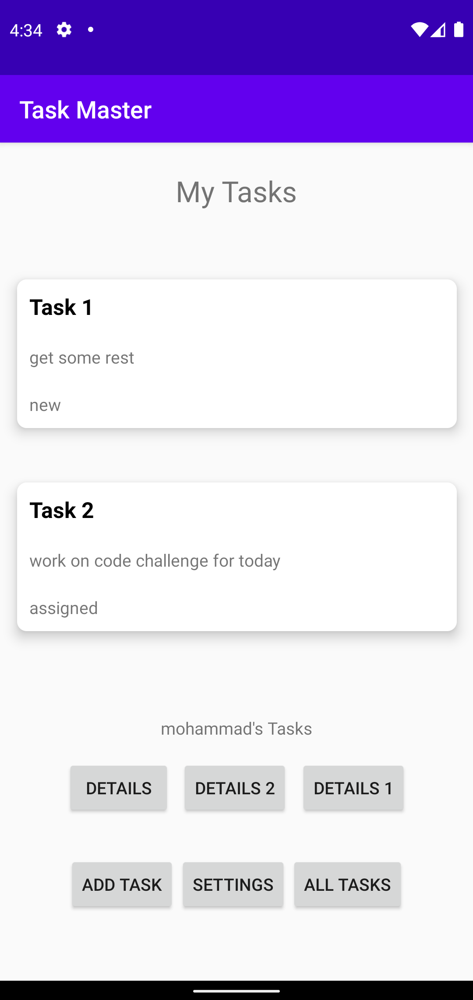

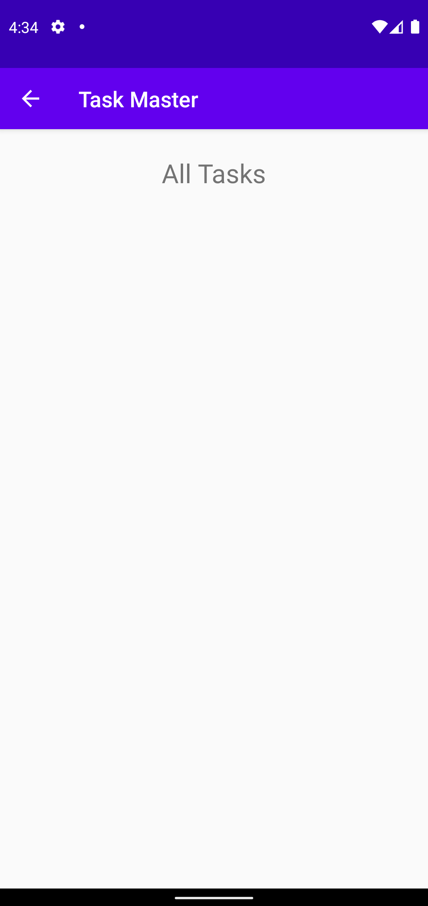

***

Screen Shots Log / 12/08/2021

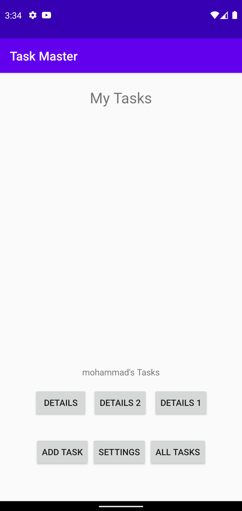

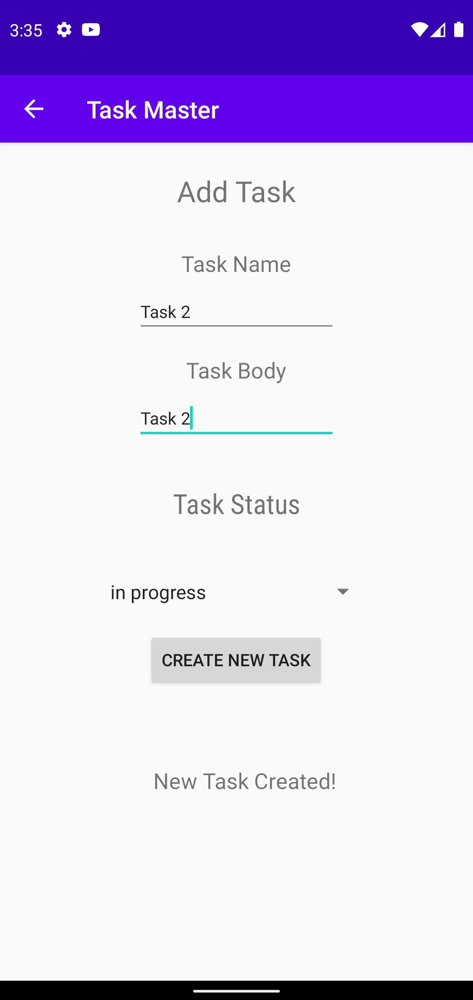

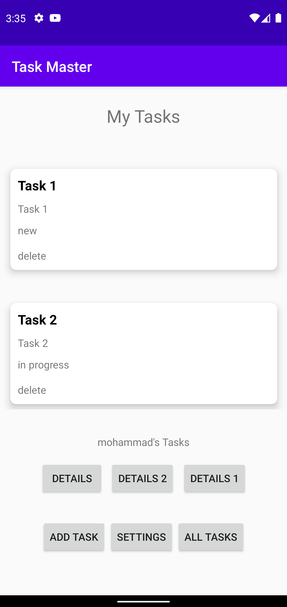

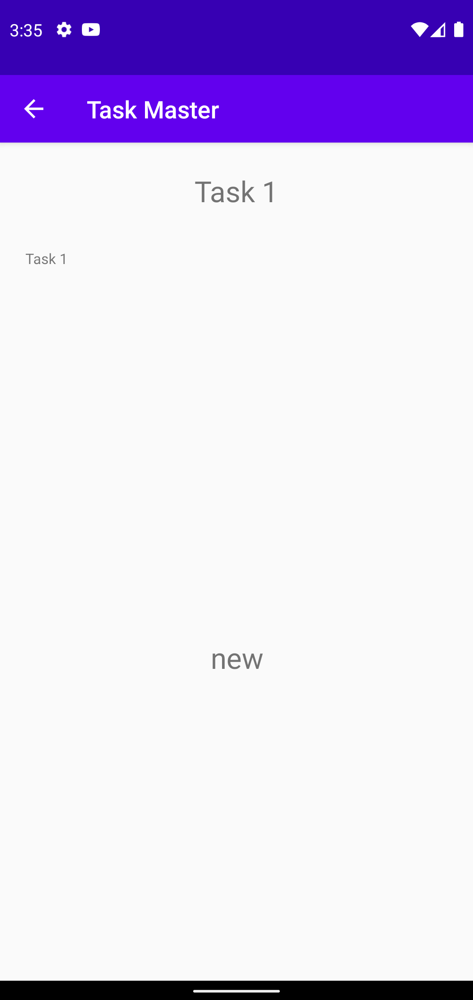

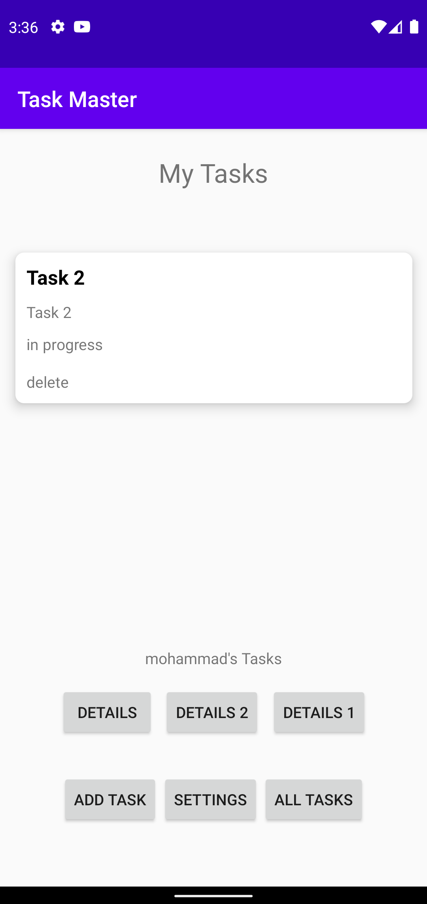
