# Task Master

Teams may use this Android app to handle tasks. Adding, assigning, tracking, and deleting tasks are
all part of this process.

***

Screen Shots Log / 09/08/2021

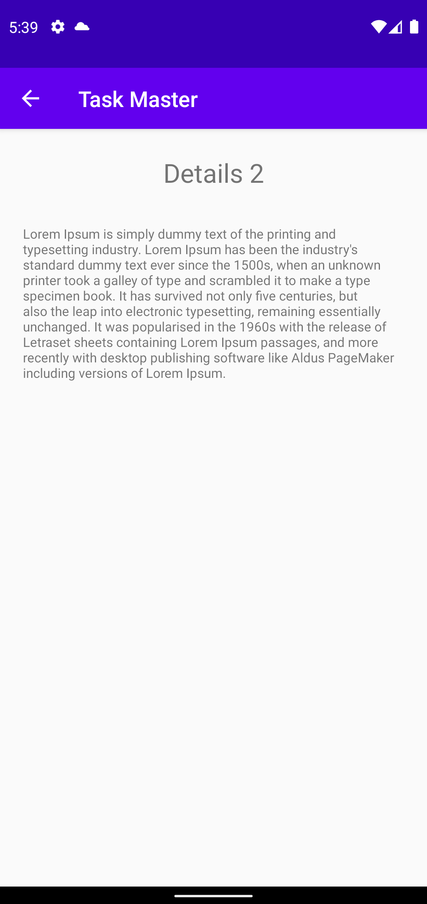

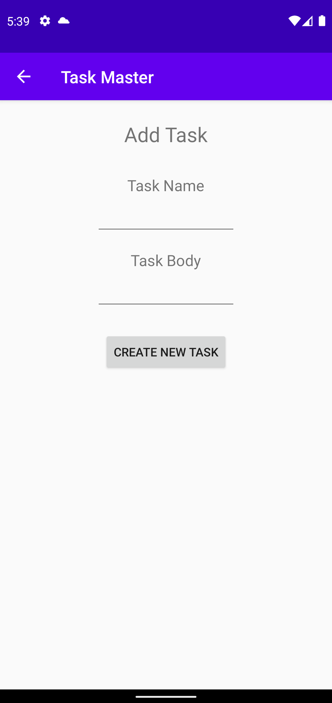

***

Screen Shots Log / 11/08/2021

***

Screen Shots Log / 12/08/2021

Screen Shots Log / 15/08/2021

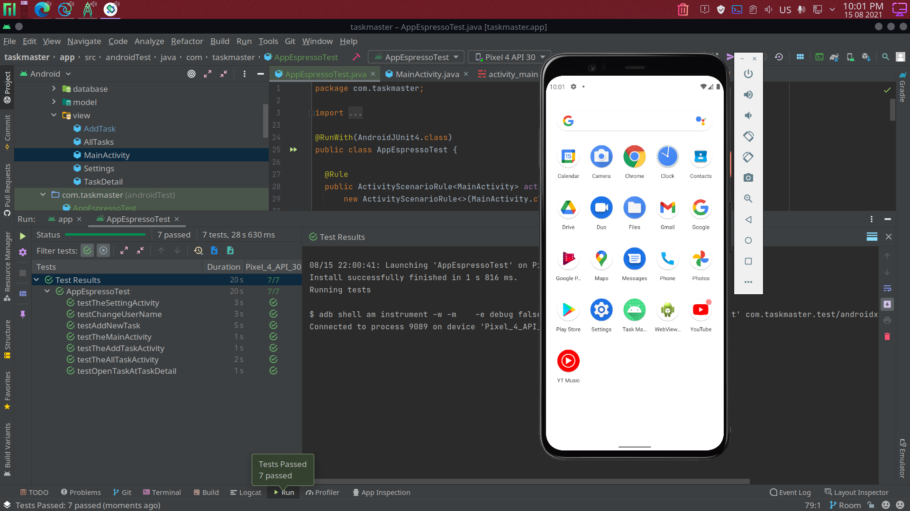

Screen Shots Log / 18/08/2021

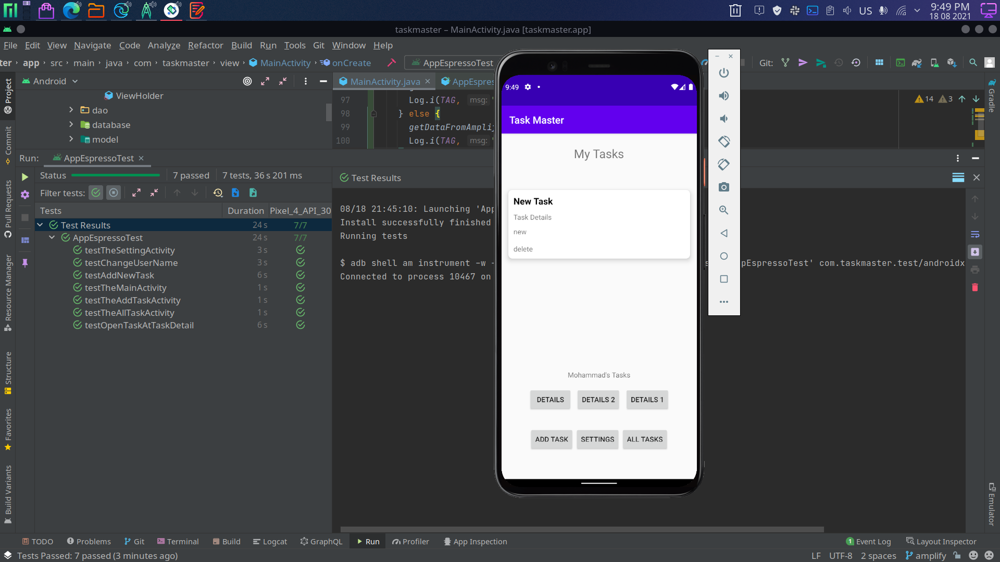

Screen Shots Log / 21/08/2021

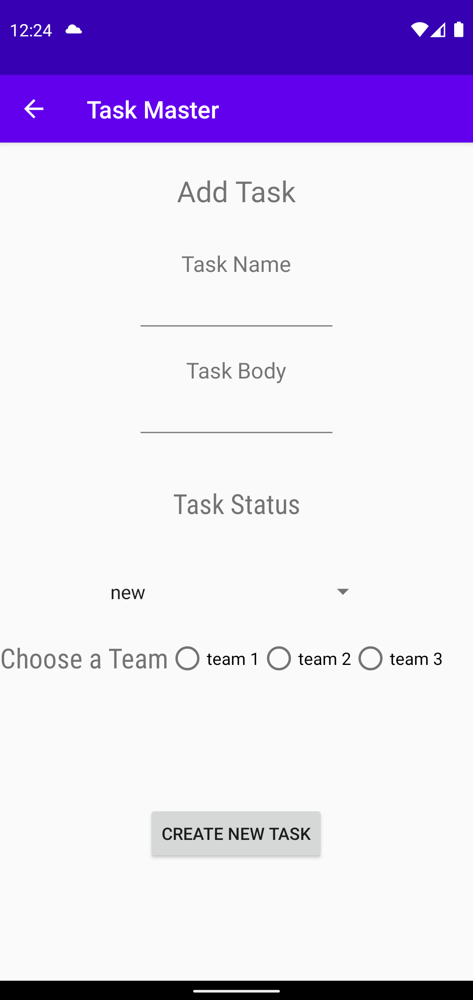

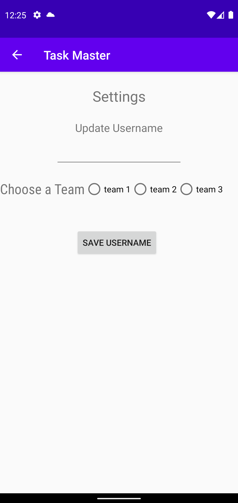

Screen Shots Log / 22/08/2021

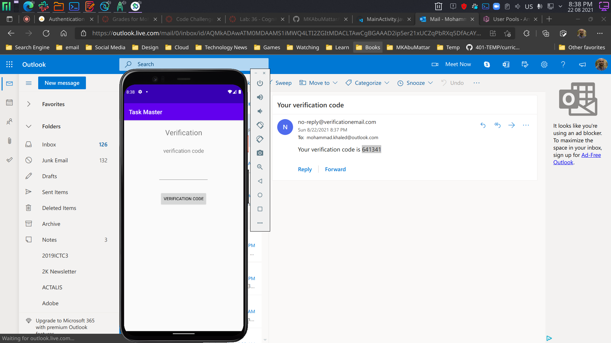

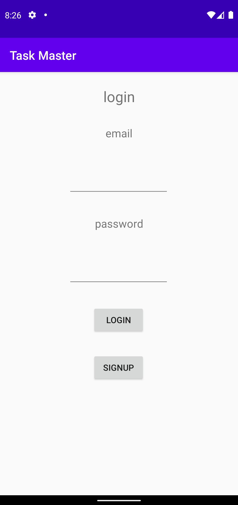

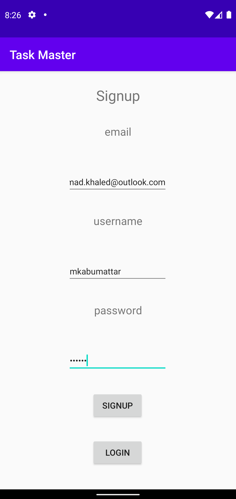

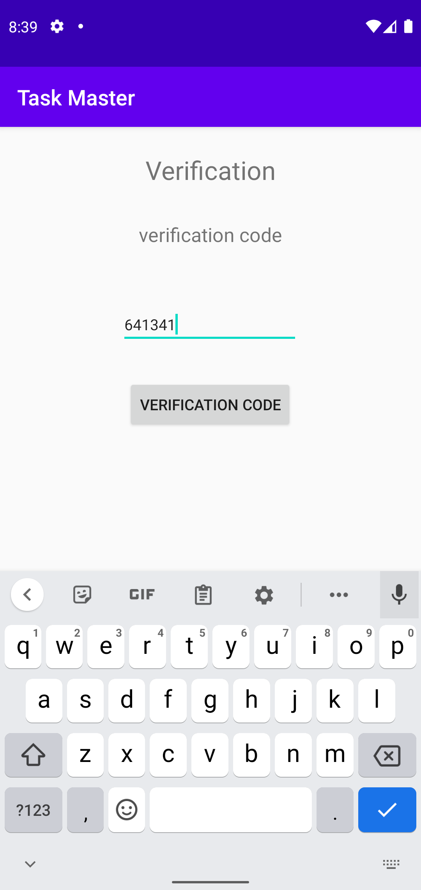

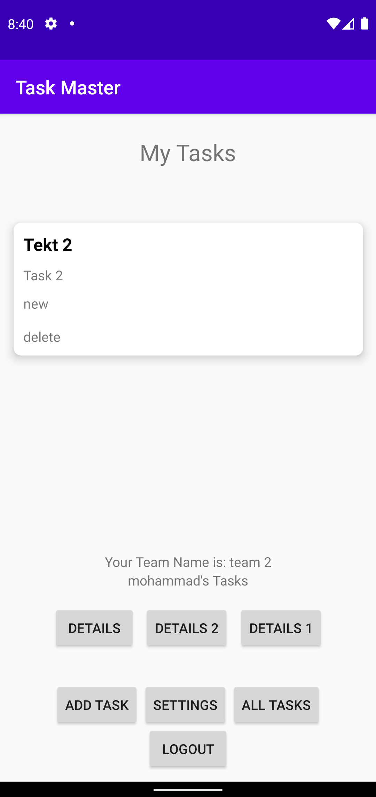

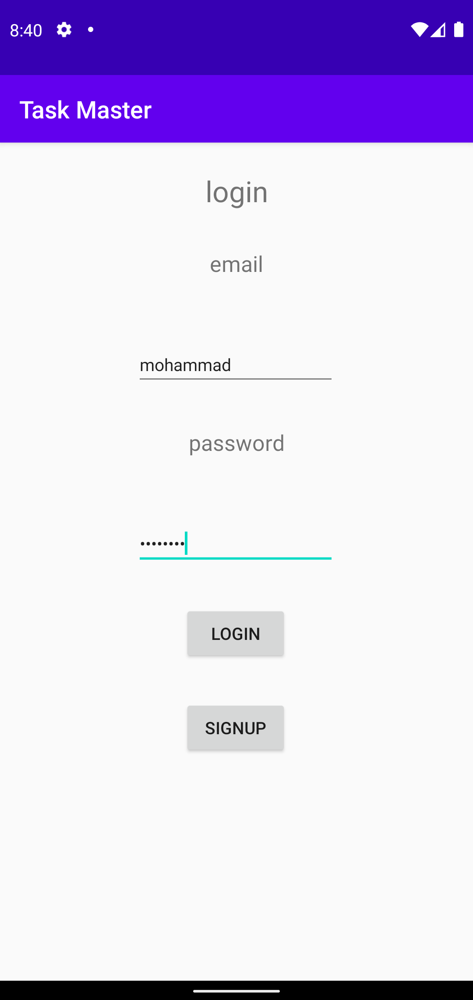